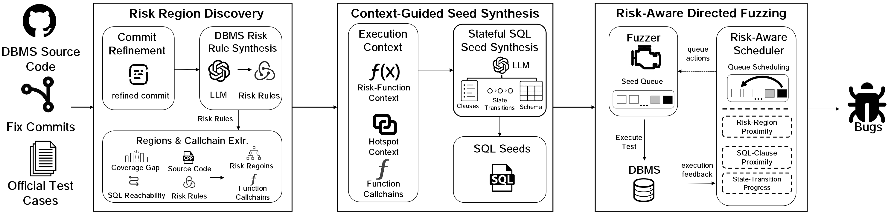

# SQLeek

SQLeek is a risk-guided DBMS fuzzing framework. It identifies SQL-reachable
risk regions from historical bug fixes and testing information, analyzes their
execution contexts to synthesize executable stateful SQL seeds, and incorporates
risk information into runtime fuzzing guidance to prioritize the exploration of
risk regions.

The current implementation supports MySQL, PostgreSQL, MariaDB, and MonetDB.



## BUGList

| DBMS | Bug ID | Status | Component | Bug Type |
|---|---|---|---|---|
| PostgreSQL | #194xx | Fixed | executor | SEGV |
| PostgreSQL | #194xx | Fixed | optimizer/plan | AF |
| PostgreSQL | #195xx | Confirmed | pl/plpgsql | SEGV |
| MySQL | S32775xx | Confirmed | Query Optimizer | NPD |
| MySQL | S32775xx | Confirmed | sql_union | SEGV |
| MySQL | S36169xx | Fixed | decimal | SEGV |
| MySQL | S32775xx | Confirmed | Query Optimizer | SEGV |
| MySQL | S32775xx | Confirmed | sql_union | NPD |
| MySQL | S30198xx | Confirmed | sql_string | SEGV |
| MySQL | S36169xx | Confirmed | item_geofunc | SEGV |
| MySQL | S30198xx | Confirmed | item_timefunc | SEGV |
| MySQL | S30198xx | Fixed | decimal | SEGV |
| MySQL | S32775xx | Confirmed | Query Optimizer | NPD |
| MySQL | S32775xx | Confirmed | Query Optimizer | NPD |
| MySQL | S32775xx | Confirmed | item_timefunc | SEGV |
| MySQL | S32775xx | Fixed | DDL/Field_time | NPD |
| MySQL | S32775xx | Fixed | DDL/Field_time | NPD |
| MySQL | S32775xx | Fixed | JSON Duality View | SEGV |
| MySQL | S32775xx | Fixed | JSON Duality View | NPD |
| MySQL | S32775xx | Fixed | JSON Duality View | NPD |
| MySQL | S32775xx | Fixed | JSON Duality View | HBOF |
| MySQL | S32775xx | Fixed | sp | HBOF |
| MySQL | S32775xx | Fixed | MySQL Client | OOBR |
| MySQL | S32775xx | Fixed | MySQL Client | OOBR |
| MariaDB | MDEV-399xx | Confirmed | Optimizer - Window functions | SEGV |
| MariaDB | MDEV-399xx | Reported | Server | SEGV |
| MariaDB | MDEV-399xx | Confirmed | Optimizer | NPD |
| MariaDB | MDEV-399xx | Fixed | GIS | NPD |
| MariaDB | MDEV-399xx | Confirmed | Optimizer - CTE | SEGV |
| MariaDB | MDEV-399xx | Fixed | Server | SEGV |
| MariaDB | MDEV-399xx | Confirmed | Optimizer | SEGV |
| MariaDB | MDEV-399xx | Confirmed | Optimizer | SEGV |
| MariaDB | MDEV-398xx | Confirmed | Optimizer | SEGV |
| MariaDB | MDEV-398xx | Reported | Server | SEGV |
| MariaDB | MDEV-398xx | Confirmed | Optimizer | SEGV |
| MariaDB | MDEV-398xx | Reported | Server | SEGV |
| MariaDB | MDEV-398xx | Reported | Server | BOF |
| MariaDB | MDEV-398xx | Reported | Server | SEGV |
| MariaDB | MDEV-398xx | Confirmed | Data Manipulation | SEGV |
| MariaDB | MDEV-398xx | Confirmed | Server | SEGV |
| MariaDB | MDEV-398xx | Confirmed | Optimizer | SEGV |
| MariaDB | MDEV-398xx | Confirmed | Optimizer | SEGV |
| MariaDB | MDEV-398xx | Confirmed | Server | SEGV |
| MonetDB | #79xx | Confirmed | gdk | NPD |
| MonetDB | #79xx | Confirmed | gdk | NPD |
| MonetDB | #79xx | Confirmed | sql/backends | NPD |
| MonetDB | #79xx | Confirmed | sql/backends | NPD |
| MonetDB | #79xx | Confirmed | sql/backends | SEGV |
| MonetDB | #79xx | Confirmed | sql/server | SEGV |
| MonetDB | #79xx | Confirmed | sql/server | SEGV |
| MonetDB | #79xx | Confirmed | sql/server | SEGV |
| MonetDB | #79xx | Confirmed | sql/server | SEGV |
| MonetDB | #79xx | Confirmed | sql/server | AF |
| MonetDB | #79xx | Confirmed | sql/server | IPD |
| MonetDB | #79xx | Confirmed | sql/server | UAF |
| MonetDB | #79xx | Confirmed | sql/common | SEGV |


## 1. Download MySQL source code

Clone the MySQL source tree under `/root/SQLeek/sources`:

```bash
mkdir -p /root/SQLeek/sources
cd /root/SQLeek/sources

git clone --depth=200 https://github.com/mysql/mysql-server.git mysql
```

## 2. Configure the LLM

```bash
cp /root/SQLeek/config.env.example /root/SQLeek/config.env
vi /root/SQLeek/config.env
```

Set the following values:

```text
SQLEEK_LLM_ENABLED=1
SQLEEK_LLM_PROVIDER=openai
OPENAI_API_KEY=your_api_key
OPENAI_BASE_URL=https://api.openai.com/v1
OPENAI_MODEL=gpt-5.5
```

## 3. Build fuzzer image

Before running the MySQL demo, build the fuzzer image with the repository
script. creates a
versioned image named `sqleek-mysql:<git-short-sha>`.
```bash
cd /root/SQLeek
bash ./sqleek_pipeline/stage3_scheduler/docker/build.sh mysql
```

Verify that the image was created:

```bash
docker image ls 'sqleek-mysql'
```

## 4. MySQL demo

Run the MySQL demo:

```bash
cd /root/SQLeek
SQLEEK_SKIP_FUZZER_BUILD=1 bash ./run.sh mysql mysqldemo 60s
```

The default output is written to:

```text
sqleek_pipeline/stage3_scheduler/output/runs/mysql/mysqldemo/
```

The demo starts the container in the background. The generated SQL seeds and
static-analysis targets are mounted into the container, while fuzzing output,
logs, runtime files, and metadata are preserved on the host.

## 5. Optional Code static analysis

If Stage 0/1 artifacts are missing, install and configure the [CodeQL CLI](https://docs.github.com/en/code-security/codeql-cli/getting-started-with-the-codeql-cli) before running `run.sh`. The wrapper will then run the MySQL static-analysis commands automatically.
